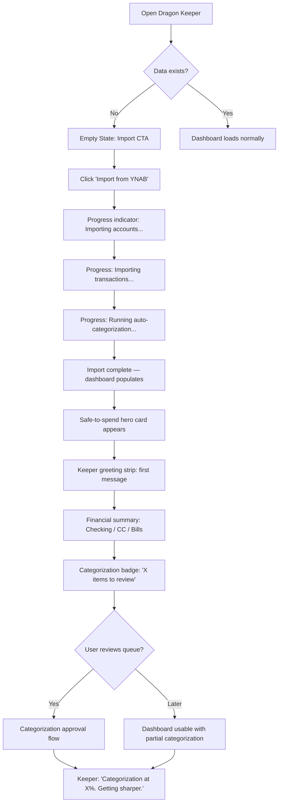
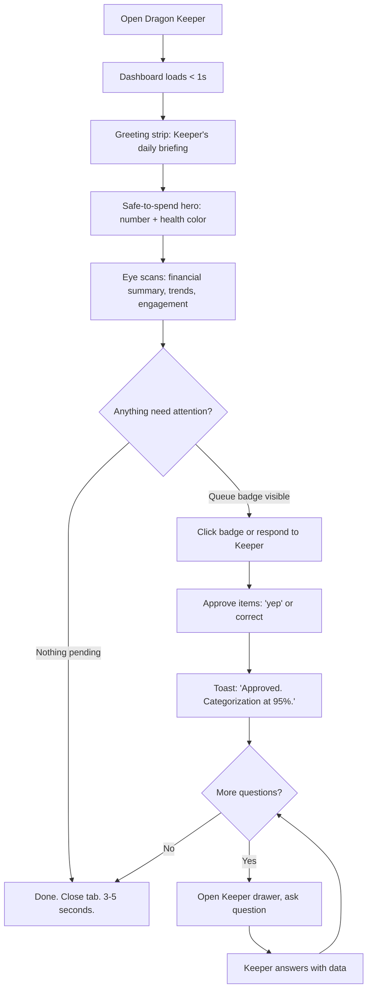
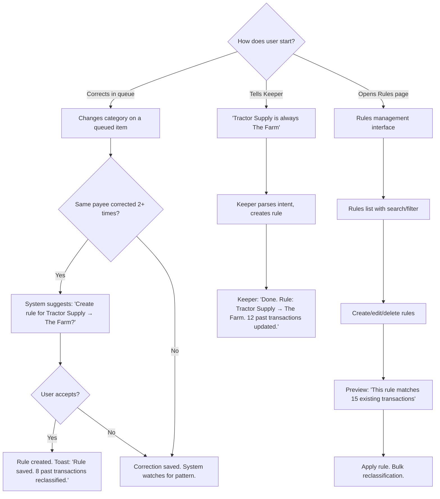
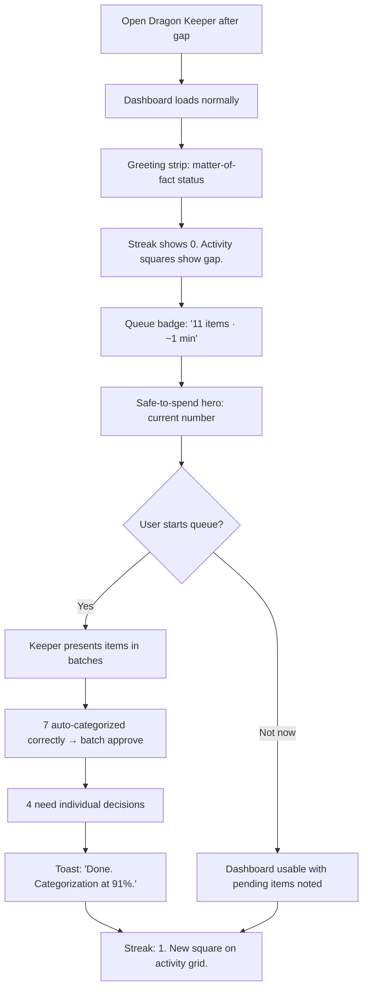
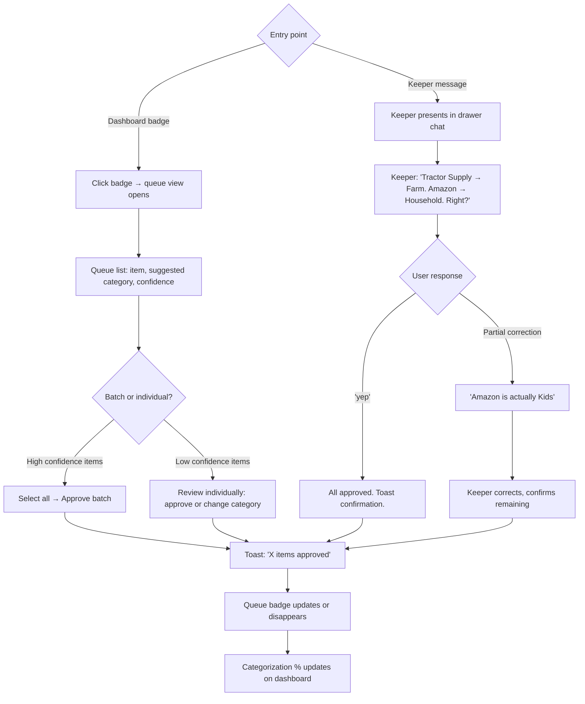
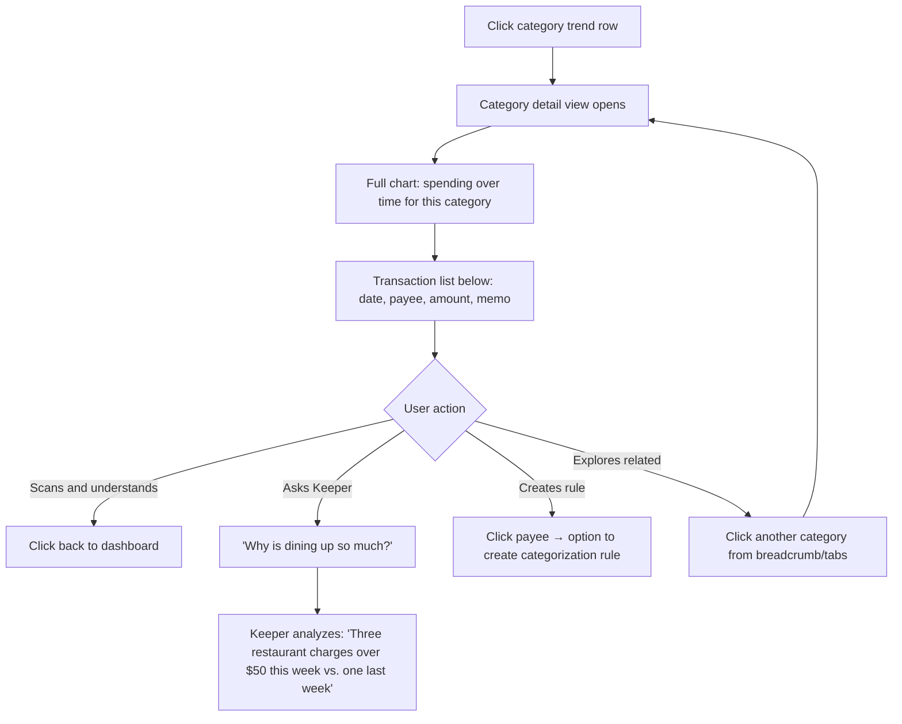

# UX Design Specification: Dragon Keeper

**Author:** Master Cody
**Date:** 2026-03-14

---

## Executive Summary

### Project Vision

Dragon Keeper is a financial relationship, not a budgeting tool. It replaces the friction-heavy YNAB experience with an agent-first, trust-building companion that delivers daily financial awareness in under 30 seconds. The core design bet: if you make the data trustworthy and the interaction effortless, the behavioral shift from credit card reliance to informed debit spending follows naturally.

The product inverts the standard personal finance interaction model. Instead of a dashboard waiting to be opened, the Dragon Keeper agent initiates contact, contextualizes the numbers, and handles the tedious categorization work that killed every previous attempt at financial discipline. The dashboard exists as a secondary surface -- a glanceable confirmation, not the primary engagement mechanism.

Within the Codiak platform, Dragon Keeper consolidates 14 fragmented YNAB Streamlit tools into a unified React + FastAPI experience with a single emotional anchor: the safe-to-spend number.

### Target Users

**Cody (Primary) -- The Household Financial Manager**
A software developer and sole income earner who manages finances for a household of four on a farm. Good income undermined by low spending visibility and a credit card safety-net cycle. Has built 14 fragmented tools trying to solve this problem -- the motivation is deep, but tool friction keeps winning. Needs to feel informed and in control in 30 seconds a day, not 30 minutes. Success means the safe-to-spend number is trusted reflexively, categorization happens without him, and the credit card stays in the wallet.

**Amanda (Secondary) -- The Financial Partner**
Cody's wife, currently in nursing school with ~18 months until earning. Does not use Dragon Keeper directly. Sees the Family View when Cody shares it. Needs clarity and evidence, not complexity. "Show me where the money goes so I can help." Her engagement comes through shared budget conversations informed by Keeper data, not through the tool itself.

**Harris (17) and George (13) -- The Family Context**
Experience Dragon Keeper indirectly through the family narrative. The dragon metaphor is their entry point -- visual, engaging, age-appropriate. Harris needs to understand money has limits before he's managing his own at 18+. George needs to stop thinking purchases are free. Their awareness is a byproduct of the system working, not a design target for the MVP.

### Key Design Challenges

1. **Trust through transparency without anxiety.** The product bet requires Cody to believe the safe-to-spend number. Sync health, categorization percentage, and confidence scores must be visible -- but surfacing data imperfection risks triggering the same abandonment that killed YNAB. The design must frame incomplete data as progress ("82% categorized and climbing") rather than failure ("18% unknown").

2. **The 30-second interaction budget.** The daily dashboard must deliver its core value -- safe-to-spend, anything needing attention, streak confirmation -- in seconds. Every additional tap, scroll, or decision point is friction that threatens the habit. The UX must ruthlessly prioritize what appears first and what hides behind a click.

3. **Dual interaction paradigms.** The glanceable dashboard and the conversational Keeper agent serve different user moments (quick status check vs. deliberative question). These must coexist without confusion -- clear entry points, distinct purposes, seamless transitions between them.

4. **Categorization that doesn't feel like work.** The validation queue is where the YNAB death spiral lived. Auto-categorization must make the queue feel tiny and fast. Conversational approval through the Keeper ("I filed 5 today -- look right?") should reduce validation to a single confirmation rather than a checklist of decisions.

5. **Solo developer sustainability.** Desktop-only, modern Chrome/Edge, no responsive breakpoints. Each component must be independently useful. The design must be implementable incrementally without requiring all pieces to exist before any piece delivers value.

### Design Opportunities

1. **The safe-to-spend number as emotional anchor.** Not just a calculation but a feeling. Color-coded health (green/yellow/red) paired with the Keeper's one-line contextual message transforms data into narrative: "You've got room to breathe" vs. "Tight week -- payday is Thursday." This is the moment that replaces the anxious credit-card-or-debit mental math.

2. **Progressive trust indicators as micro-celebrations.** Categorization progress filling up, sync health lights going green, streak counters growing -- these are small victories that reinforce the daily habit. Data quality becomes a game you're winning rather than a chore you're behind on.

3. **The Keeper's voice as a retention mechanism.** Varied, warm, occasionally surprising daily messages create something Cody looks forward to rather than dismisses. This persona -- part guardian, part narrator, part trusted advisor -- is what separates Dragon Keeper from every spreadsheet and every dashboard. The relationship is the product.

4. **Conversational categorization as the ultimate friction killer.** Instead of a queue with checkboxes, the Keeper presents pending categorizations in natural language for one-word approval. This collapses a 2-minute chore into a 10-second confirmation and makes the system feel like it's working *for* Cody, not assigning him homework.

## Core User Experience

### Defining Experience

The Dragon Keeper experience is defined by a single moment: Cody opens the app and in 3 seconds knows whether he's financially okay today. The safe-to-spend number is the emotional anchor -- big, bold, color-coded -- but it's contextualized by the Keeper's voice and surrounded by trend indicators that tell the story of where money is going.

The core interaction loop is:
1. **Arrive** -- Keeper greets with context (safe-to-spend, insights, items needing attention)
2. **Scan** -- Dashboard delivers spending trends, streaks, sync health at a glance
3. **Confirm** -- Any pending categorizations approved in seconds via Keeper or inline UI
4. **Done** -- Under 30 seconds. Day started with clarity.

The secondary loop is conversational: "Can we afford takeout tonight?" "What did we spend on Amazon this month?" "Show me the farm expenses." The Keeper answers with real data, grounded in the local cache.

### Platform Strategy

**Primary platform:** Desktop web application (React + FastAPI within Codiak)
- Modern Chrome/Edge only
- Mouse/keyboard primary interaction
- No mobile, no responsive breakpoints
- No offline requirement -- always-connected desktop use

**Integration within Codiak:**
- Dragon Keeper registered as a tool in `TOOL_COMPONENTS` map
- Routes nested under `/tool/dragon-keeper/*`
- Follows existing Codiak React patterns (TanStack Query, React Router, apiFetch)

**Agent presence architecture:**
- Persistent Keeper panel available on every Dragon Keeper page (drawer/panel that can be toggled)
- Dedicated full chat experience for deeper conversational interactions
- Dashboard is the primary data surface; Keeper is the primary relationship surface
- Push-first: the Keeper greets proactively on arrival, not waiting for user input

**Future platform expansion:**
- Discord/similar chat platform for push notifications and conversational engagement outside the app (Phase B+)
- The in-app agent establishes the relationship; external channels extend it

### Effortless Interactions

**Must be zero-friction:**
- Seeing the safe-to-spend number (instant on page load, no clicks)
- Approving auto-categorized transactions (single confirmation, not per-item decisions)
- Understanding spending trends (sparklines and +/- indicators visible without drilling in)
- Knowing if anything needs attention (badges, Keeper proactive messaging, inline indicators)

**Must be automatic:**
- Transaction categorization for known patterns (rules engine)
- High-confidence LLM categorization (auto-applied above threshold)
- Sync health monitoring and staleness warnings
- Streak tracking and dragon state calculation
- Keeper's daily greeting and contextual insight generation

**Must be one-click-away:**
- Drilling into any trend sparkline for full category detail
- Viewing transaction history for a specific category or payee
- Accessing the categorization queue from any surface (dashboard badge, Keeper mention, dedicated view)
- Opening the Keeper panel from any Dragon Keeper page

### Critical Success Moments

1. **The First Trusted Number (Day 1).** After initial import and auto-categorization, the safe-to-spend number appears. Even at 70% categorization, if the number feels grounded -- if the Keeper says "This is based on what I know so far, and I'll get sharper as we categorize more" -- Cody starts to believe. This is the moment the YNAB death spiral path diverges.

2. **The First Debit Decision (Day 2-7).** Cody is about to buy lunch. He checks the safe-to-spend number. It's green. He pays with the debit card instead of reaching for the credit card. This is the behavioral proof point -- the moment the product delivers its core value.

3. **The First 30-Second Day (Week 2).** Dashboard loads. Keeper says good morning with context. Two transactions to confirm -- "yep." Done. Coffee isn't even ready yet. This is the moment the habit locks in -- when using Dragon Keeper feels *easier* than not using it.

4. **The First "I Can See It" (Month 2).** Cody shows Amanda the spending trends. Sparklines tell the story. The Keeper can narrate: "Dining out is 40% of your food budget. Farm expenses are up $200 from last month -- that's the fence repair." Amanda says: "Oh. THAT'S why." The family alignment moment.

5. **The Recovery Without Shame (Inevitable).** Three days missed. Queue has 11 items. Streak at zero. The Keeper doesn't guilt -- it welcomes: "Welcome back. 11 to review, safe-to-spend is $180. About a minute." The tool survived the gap. Trust survives.

### Experience Principles

1. **Thirty Seconds or Thirty Minutes -- User Chooses.** The dashboard delivers full value in a glance. Trends, sparklines, and drill-downs reward curiosity. The Keeper is always available for deeper conversation. But the daily requirement is 30 seconds, and the design never demands more.

2. **The Keeper Speaks First.** On every arrival, the Keeper has already prepared context. The user never lands on a blank screen or an empty chat. Push, don't pull. The relationship feels alive and attentive.

3. **Progress, Not Perfection.** Data quality indicators frame incompleteness as a journey ("82% categorized and climbing") rather than a failure state. Every categorization approval, every rule created, every day checked in is visible forward motion.

4. **Information-Dense but Scannable.** The dashboard is a cockpit, not a billboard. Safe-to-spend is the hero, but sparklines, +/- trend indicators, badges, and health lights surround it in a tight, readable grid. White space serves hierarchy, not emptiness.

5. **The Agent Is Everywhere.** The Keeper panel is accessible from every Dragon Keeper page. Categorization surfaces in the Keeper's conversation, as dashboard badges, and as inline UI. There is no single path -- every surface connects to every other.

## Desired Emotional Response

### Primary Emotional Goals

**The Core Emotional Arc:** Anxiety → Relief → Control → Confidence → Pride

Dragon Keeper transforms the relationship with personal finance from avoidance-driven to engagement-driven. The fundamental emotional shift: finances stop being something Cody dreads looking at and become something he checks reflexively because it makes him feel informed and capable.

| Emotional Goal | Description | Design Implication |
|----------------|-------------|--------------------|
| **Informed without effort** | The primary feeling on every visit. Cody didn't have to work to know where he stands. | Safe-to-spend and Keeper greeting load instantly with context already prepared |
| **Honest control** | Not false comfort -- real awareness that enables real decisions. Blunt numbers with actionable context. | Red means red. Low safe-to-spend is stated plainly with recommendations and timing ("$47 left. Groceries covered. Phone bill Thursday.") |
| **Earned trust** | Confidence that the number is real, built through visible data quality. | Categorization %, sync health, and confidence indicators always visible |
| **Quiet pride** | The streak growing, the categorization rate climbing, the number staying green longer. Not celebrated loudly -- just visible. | Progress indicators that grow organically; no confetti, no badges, just satisfying forward motion |
| **Family clarity** | When Amanda sees the data, she feels informed and empowered to participate -- not blamed, not lectured, not overwhelmed. | Family View leads with facts and plans, not emotional framing. Clarity is the onramp. |

### Emotional Journey Mapping

| Stage | Current Emotion | Target Emotion | Design Response |
|-------|----------------|----------------|-----------------|
| **Before Dragon Keeper** | Anxiety, avoidance, shame. "I should be doing this but I can't face it." | -- | -- |
| **First open (Day 1)** | Nervous curiosity. "Will this be another tool I abandon?" | Grounded relief. "Oh. I can see the number. It's real." | Safe-to-spend appears immediately. Keeper contextualizes without judgment. Import progress visible. |
| **Daily check (Week 2)** | Neutral habit. "Let me check the number." | Informed calm. "I know where I stand." | 3-second dashboard load. Keeper has context ready. Nothing demands attention unless something genuinely does. |
| **Low safe-to-spend** | Anxiety spike. "This is bad." | Equipped awareness. "This is tight, but I know what's coming and what to do." | Blunt number. Keeper provides: upcoming income timing, what's already committed, specific recommendation. No softening. |
| **Categorization queue** | Dread. "Not more data entry." | Quick competence. "Done in 10 seconds." | Keeper presents items conversationally. Batch approval. Queue count is small because auto-categorization handled the bulk. |
| **Streak break** | Guilt, avoidance. "I fell off. It's ruined." | Matter-of-fact re-engagement. "Here's where things stand." | Keeper does not acknowledge the gap emotionally. No "welcome back," no guilt, no fake warmth. States the situation, the queue size, the safe-to-spend, what changed. Streak counter resets silently. |
| **Showing Amanda** | Vulnerability. "I have to explain why things are this way." | Shared clarity. "Here are the facts. Here's our plan." | Family View leads with data, not narrative framing. Paycheck tracer shows where every dollar goes. No emotional onramp needed -- clarity IS the onramp for this family. |
| **Month 3+** | Ownership. "I built this habit." | Quiet confidence. "I know my money." | Dashboard is familiar territory. Trends show real change. The data tells the story without the Keeper needing to narrate it. |

### Micro-Emotions

**Critical emotional states to cultivate:**

- **Confidence over confusion.** Every number, every indicator, every Keeper message should make Cody feel more certain, not less. If something is uncertain (low categorization, stale sync), state it plainly and say what's being done about it.
- **Trust over skepticism.** Transparency is the mechanism. Showing the categorization percentage, the sync health, the confidence scores -- "I'm 82% sure about this number, and here's why" -- builds trust faster than hiding uncertainty.
- **Competence over frustration.** Every interaction should feel like Cody is good at this. Categorization is fast. Questions get clear answers. The dashboard delivers in seconds. The tool makes him feel capable, not overwhelmed.

**Critical emotional states to prevent:**

- **Shame.** Never. Not when the number is red, not when the streak breaks, not when categorization is behind. The Keeper is an advisor in a war room, not a disappointed parent.
- **Overwhelm.** If the queue is large, break it down ("11 to review, about a minute"). If the dashboard has too much, progressive disclosure. Never present everything at once.
- **Helplessness.** Every problem state comes with a next action. Low safe-to-spend → "payday is Thursday." Stale sync → "tap to refresh." Behind on categorization → "7 items, 30 seconds."

### Design Implications

| Emotion to Create | UX Mechanism |
|-------------------|-------------|
| Informed without effort | Keeper greeting pre-loaded on arrival; safe-to-spend renders first; no interaction required for core value |
| Honest control | Red numbers are red. Low balances stated bluntly. Every warning includes timing and recommendation. |
| Earned trust | Categorization %, sync health lights, and data freshness always visible in dashboard header. Progress framed positively but never fabricated. |
| Quick competence | Categorization queue shows count + estimated time ("5 items, ~20 seconds"). Batch approval. Conversational approval via Keeper. |
| Matter-of-fact recovery | Streak resets visually without narration. Keeper states situation + queue + safe-to-spend. No emotional language about the gap. |
| Family clarity | Family View is data-first. Paycheck tracer, category breakdowns, trend lines. Amanda gets equipped with facts to participate, not persuaded with narrative. |

### Emotional Design Principles

1. **Blunt with context, never blunt alone.** The Keeper delivers honest numbers and always follows with actionable information. "$47 left" is anxiety. "$47 left. Groceries covered. Phone bill Thursday. Payday Friday." is control.

2. **The war room advisor, not the disappointed parent.** The Keeper's emotional register is steady, competent, and direct. It doesn't celebrate excessively or mourn failures. It states reality and recommends action. Think military briefing with a human voice, not a therapy session.

3. **Silence is respect.** When the streak breaks, the Keeper's silence about it IS the emotional design. Not mentioning the gap communicates: "I'm not here to judge your consistency. I'm here to give you the picture." The streak counter resets. The Keeper moves on.

4. **Clarity is kindness.** For Amanda, for the family, for Cody himself -- the most compassionate thing Dragon Keeper can do is show the truth clearly. No sugar-coating, no emotional onramps, no "let me ease you into this." The numbers are the numbers. The plan is the plan. Clarity enables partnership.

5. **Every problem state has a next step.** No dead ends. No screens that say "things are bad" without saying what to do. The emotional promise: you will never feel helpless in Dragon Keeper. There is always a next action.

## UX Pattern Analysis & Inspiration

### Inspiring Products Analysis

**Obsidian -- The Local-First Power Tool**
What it does right: Speed, simplicity at the surface, infinite depth underneath. Markdown-native -- the data is yours, the format is transparent. No onboarding wizards, no hand-holding. Opens fast, renders fast, stays out of your way. The plugin ecosystem adds capability without cluttering the core. Graph view gives a visual understanding of connections that would be invisible in a file tree.

Transferable lesson for Dragon Keeper: The dashboard should feel this fast and this clean. Core functionality is immediate on load. Advanced features exist but don't compete for attention. Data transparency (sync health, categorization %) mirrors Obsidian's "it's just files" honesty -- you always know what's real.

**Claude Code -- The Agent That Does the Work**
What it does right: Conversational interface that produces real results. You describe intent; the agent executes with full context. It reads files, writes code, runs commands -- the agent isn't a suggestion engine, it's a worker. The interaction is collaborative but the agent takes initiative. You review, approve, redirect.

Transferable lesson for Dragon Keeper: The Keeper should not just answer questions -- it should do the work. Auto-categorize and present results for approval. Prepare the daily debrief before Cody arrives. Surface anomalies proactively. The Keeper is a Claude Code for your finances: context-aware, action-oriented, always one step ahead.

**Claude Cowork -- Autonomous Agent with Human Review**
What it does right: The agent works independently on complex tasks, reports back with results, and the human reviews and steers. The agent has agency and initiative. The human has oversight and final authority.

Transferable lesson for Dragon Keeper: The categorization pipeline mirrors this model perfectly. The Keeper categorizes autonomously (rules + LLM), reports what it did, and Cody reviews and approves. The daily debrief is an autonomous report the Keeper prepares and presents. The interaction model is: Keeper works → Keeper reports → Cody confirms. Not: Cody requests → Keeper responds.

**Alluvial Diagrams / Spending Flow Visualization**
What they do right: Tell the story of where money goes in a single visual. Income flows through categories to destinations. The narrative is spatial -- you can trace a dollar from paycheck to expense. Vastly more informative than pie charts for understanding money flow, though simple pie/stacked charts work well for category breakdowns.

Transferable lesson for Dragon Keeper: The drill-down from sparklines should lead to rich visualizations. The alluvial diagram (already exists in Codiak's Streamlit tools) becomes a key detail view. Category breakdowns use simple, clean charts. Visualization serves the narrative: "where does the money go?" has a visual answer.

### Transferable UX Patterns

**Navigation & Information Architecture:**
- **Obsidian's minimal chrome pattern.** Content fills the viewport. Navigation is minimal and keyboard-accessible. No sidebars competing for attention unless explicitly opened. Dragon Keeper's dashboard should maximize data density with minimal UI furniture.
- **Agent-as-navigator pattern (Claude Code).** Instead of drilling through menus to find a view, ask the Keeper: "Show me farm expenses this month." The agent navigates the UI, surfaces the view, highlights what matters. The chat IS the navigation for complex queries.

**Interaction Patterns:**
- **Work-then-review pattern (Claude Cowork).** The system does the heavy lifting autonomously; the user reviews and approves. Categorization pipeline: Keeper categorizes → presents results → Cody approves. Daily debrief: Keeper prepares → presents on arrival → Cody reads. This inverts the traditional "user initiates, system responds" model.
- **Conversational action pattern (Claude Code).** Natural language triggers real system actions. "Categorize all Tractor Supply as The Farm" creates a rule. "What did we spend on Amazon?" pulls the data and displays it. The Keeper doesn't just chat -- it operates.
- **Fast inline confirmation.** Approving categorizations should feel like reviewing Claude Code's changes -- a quick scan, a "yes," and you're moving. Not a form submission, not a modal dialog.

**Visual & Data Patterns:**
- **Information-dense dashboard (cockpit model).** Safe-to-spend hero number surrounded by sparklines, trend indicators, and health lights. Similar density to a well-configured Obsidian workspace -- everything visible, nothing wasted.
- **Alluvial/Sankey for flow, pie/stacked for composition.** Two complementary visualization approaches: alluvial diagrams answer "where does the money go?"; pie and stacked charts answer "what's the breakdown?" Both available as drill-downs from the dashboard.
- **Sparklines with +/- indicators.** Every category on the dashboard shows a tiny trend line and a delta vs. last period. Scannable at a glance, clickable for detail. Inspired by financial terminal interfaces that pack maximum information into minimum space.

### Anti-Patterns to Avoid

| Anti-Pattern | Why It Fails | Dragon Keeper Alternative |
|-------------|-------------|--------------------------|
| **Complicated workflows** | Multiple steps to accomplish simple tasks. Every click is friction that threatens abandonment. | One-click or conversational actions. Categorize with "yep." Import with one button. Ask the Keeper instead of navigating menus. |
| **Dated visual design** | Old-feeling UI signals "this is a chore tool" before the user even interacts. Creates unconscious resistance. | Modern, clean, dark-mode-friendly design. Obsidian-level polish. Minimal chrome, maximum content. |
| **Buried features** | "Hard to trigger" -- capabilities exist but are hidden behind menus, settings, or non-obvious paths. Users never discover them. | The Keeper surfaces capabilities proactively. Frequently needed actions are always one click away. The agent-as-navigator pattern means anything can be reached by asking. |
| **Form-heavy input** | Traditional finance apps demand structured input: dropdown categories, date pickers, amount fields. Each field is friction. | Conversational input where possible. The Keeper interprets "Tractor Supply is always The Farm" and creates the rule. Structured forms only where truly necessary (manual transaction creation). |
| **Passive dashboards** | Dashboards that display data but don't act. The user looks, then has to go elsewhere to do something about what they see. | Every data point on the dashboard connects to an action. Click a category sparkline → see transactions. See a categorization badge → approve inline. The dashboard is interactive, not a report. |
| **Onboarding wizards** | Step-by-step setup flows that delay the core value. Users want to see results, not configure settings. | First value (safe-to-spend number) appears after import completes. Configuration happens organically through use: rules created from corrections, categories learned from behavior. |

### Design Inspiration Strategy

**Adopt directly:**
- Obsidian's minimal chrome and content-first layout philosophy
- Claude Code/Cowork's work-then-review interaction model for categorization
- Alluvial diagrams for spending flow visualization (already exists in codebase)
- Sparkline + delta indicators for category trend display

**Adapt for Dragon Keeper:**
- Claude Code's conversational-action model → Keeper that creates rules, pulls data, and navigates views through natural language
- Obsidian's plugin extensibility philosophy → Dragon Keeper phases as progressive capability additions to a solid core
- Financial terminal density → scaled for a solo user rather than a trading floor, but keeping the information-rich ethos

**Explicitly avoid:**
- YNAB's categorization friction (manual, per-transaction, form-based)
- Traditional finance app visual language (sterile, corporate, chart-heavy landing pages)
- Wizard-based onboarding or configuration
- Passive read-only dashboards that separate viewing from acting
- Hidden or menu-buried capabilities

## Design System Foundation

### Design System Choice

**Primary:** Shadcn/ui (Tailwind CSS + Radix UI Primitives) layered on top of Codiak's existing CSS custom property token system.

**Charting:** Recharts (or similar lightweight React charting library) for sparklines, trend indicators, and category breakdowns. A dedicated Sankey/alluvial library for spending flow visualization.

### Rationale for Selection

1. **Solo developer velocity.** Shadcn/ui provides pre-built, accessible, production-ready components (drawer, dialog, command palette, data table, toast) that would take weeks to build from scratch. Dragon Keeper needs all of these.

2. **Ownership, not dependency.** Shadcn/ui components are copied into your project, not imported from node_modules. You own and modify the source. This aligns with the Obsidian philosophy: your data, your code, your control.

3. **Tailwind accelerates iteration.** Utility-first CSS enables rapid prototyping and fine-tuning of Dragon Keeper's information-dense dashboard without writing new CSS classes for every variant. Composable utilities match the cockpit layout needs.

4. **Radix primitives handle accessibility.** Keyboard navigation, focus management, ARIA attributes -- all handled by Radix under the hood. Critical for the Keeper drawer panel, categorization dialogs, and command interactions.

5. **Theming aligns with existing tokens.** Shadcn/ui uses CSS custom properties for theming. Codiak's existing token system (`--bg-primary`, `--accent`, `--text-muted`, etc.) maps directly to Shadcn's theming layer. The dark palette carries over with minimal translation.

6. **Charting is a focused addition.** Rather than a full component library for visualization, a lightweight React charting library provides sparklines, bar/pie charts, and trend lines. The existing Streamlit alluvial diagram code provides the pattern for the Sankey migration.

### Implementation Approach

**Phase 1: Foundation Setup**
- Install Tailwind CSS and configure with Codiak's existing design tokens
- Initialize Shadcn/ui with dark theme matching current `--bg-primary` through `--accent` palette
- Map existing CSS custom properties to Tailwind config and Shadcn theme tokens
- Existing Codiak pages continue using current CSS; Dragon Keeper uses the new system

**Phase 2: Core Components (Dragon Keeper MVP)**
- **Sheet/Drawer** -- Keeper agent panel (persistent, toggleable from any DK page)
- **Card** -- Dashboard metric cards (safe-to-spend, streak, categorization %)
- **Table** -- Transaction list, categorization queue
- **Badge** -- Status indicators, categorization counts, sync health
- **Button** -- Action triggers (import, approve, categorize)
- **Input + Chat bubbles** -- Keeper conversation interface (custom-built on Shadcn primitives)
- **Progress** -- Categorization progress bar
- **Toast** -- Confirmation feedback (categorization approved, rule created)

**Phase 3: Data Visualization**
- Sparkline components for category trend indicators
- Bar/pie charts for category breakdowns
- Sankey/alluvial diagram for spending flow (migrated from existing Streamlit tool)
- Color-coded safe-to-spend indicator (green/yellow/red using semantic tokens)

**Coexistence strategy:** Dragon Keeper pages use Tailwind + Shadcn/ui. Existing Codiak tool pages remain on the current custom CSS system. Both systems share the same design token values (colors, radii, fonts) to maintain visual coherence across the platform. Migration of existing pages is optional and incremental.

### Customization Strategy

**Token mapping from existing Codiak system to Shadcn/Tailwind:**

| Codiak Token | Tailwind/Shadcn Equivalent | Value |
|-------------|---------------------------|-------|
| `--bg-primary` | `background` | `#0d0f13` |
| `--bg-secondary` | `secondary` | `#141720` |
| `--bg-card` | `card` | `#1a1e2a` |
| `--bg-hover` | `muted` | `#22273a` |
| `--border` | `border` | `#2a2f42` |
| `--accent` | `primary` | `#6366f1` |
| `--text-primary` | `foreground` | `#e2e8f0` |
| `--text-muted` | `muted-foreground` | `#6b7280` |
| `--success` | `--success` (custom) | `#10b981` |
| `--warning` | `--warning` (custom) | `#f59e0b` |
| `--danger` | `destructive` | `#ef4444` |

**Typography:** Inter font family preserved. Base size 14px. Dashboard may use tighter 12-13px for information density.

**Custom components to build on Shadcn primitives:**
- Keeper chat interface (message list, streaming response, agent avatar, input)
- Sparkline widget (small inline chart component)
- Safe-to-spend hero card (oversized number + color coding + Keeper message)
- Health indicator lights (sync status per account)
- Trend delta badges (+/- with color coding)

**Design language direction:** Dark, minimal chrome, information-dense. Obsidian's spatial efficiency meets a financial terminal's data density. Indigo accent for interactive elements; green/amber/red reserved exclusively for financial health semantics (safe-to-spend, sync status, categorization confidence).

## Defining Interaction

### The Defining Experience

**Dragon Keeper in one sentence:** "I open it and The Keeper already knows where I stand -- I trust it."

The defining experience is not a feature, an animation, or a flow. It is the moment Cody realizes the data is trustworthy and the agent is competent. Every other interaction -- the dashboard, the sparklines, the alluvial diagrams, the family view -- flows downstream from this trust.

The closest analogy: the relationship between a commander and a trusted intelligence officer. The officer has been watching the situation overnight, has prepared the briefing, and is ready to answer questions. The commander's job is to make decisions with the intelligence provided. The officer never needs to be asked to do their job -- they've already done it.

Dragon Keeper's defining experience is this trust relationship made digital:
- The Keeper works autonomously (categorizes, analyzes, monitors)
- The Keeper reports on arrival (safe-to-spend, insights, items needing attention)
- Cody reviews and decides (approve categorizations, ask questions, take action)

If a friend asks "what is Dragon Keeper?" the answer is: "It's like having someone who watches my money for me and gives me a straight answer every morning."

### User Mental Model

**Dual-mode mental model:** Dragon Keeper serves two distinct cognitive modes, and the user flows between them naturally.

**Mode 1: Weather Check (Glance)**
- Mental model: "Let me check the number"
- Duration: 3-10 seconds
- Interaction: Open → see safe-to-spend → see if anything needs attention → done
- Frequency: Daily, sometimes multiple times
- Emotional register: Neutral, habitual, like checking the temperature before leaving the house
- Design response: Dashboard hero area delivers full value with zero interaction

**Mode 2: Advisor Conversation (Depth)**
- Mental model: "I have a question about my money"
- Duration: 30 seconds to several minutes
- Interaction: Open Keeper panel → ask question → get data-grounded answer → potentially take action
- Frequency: Several times per week, situationally triggered ("can we afford this?")
- Emotional register: Deliberative, curious, sometimes anxious (low balance, big purchase decision)
- Design response: Keeper chat panel with full financial data access, conversational categorization, trend exploration

**The transition between modes is seamless.** The dashboard IS the weather check. The Keeper panel IS the advisor. They coexist on the same screen. A glance at the dashboard might trigger a question for the Keeper ("why is dining up 30%?"). A Keeper conversation might surface a dashboard view ("let me show you the farm expenses trend"). The modes are not separate features -- they are two ways of engaging with the same trusted intelligence.

**What users bring from current solutions:**
- From YNAB: Expectation of envelope-style categories, transaction lists, budget vs. actual. Dragon Keeper uses YNAB's category structure but eliminates the manual categorization friction.
- From banking apps: Expectation of seeing balances and recent transactions quickly. Dragon Keeper meets this but adds the safe-to-spend calculation that no banking app provides.
- From Claude Code/Cowork: Expectation that an agent can do real work autonomously and present results for review. Dragon Keeper's Keeper agent follows this model for categorization and analysis.

### Success Criteria

**The core interaction succeeds when:**

| Criterion | Measurement | What It Proves |
|-----------|-------------|----------------|
| Cody believes the safe-to-spend number | Uses debit card instead of credit card based on the number | Trust is established |
| The Keeper's greeting feels relevant | Cody reads the greeting and it contains information he didn't already know | The agent is intelligent, not templated |
| Categorization is invisible | Queue has fewer than 5 items on a typical day | Auto-categorization pipeline is working |
| Questions get grounded answers | Keeper responds with specific data, not generic advice | The agent has real financial context |
| The daily check takes under 30 seconds | Measured by time from open to close on a no-action-needed day | Friction is eliminated |
| Recovery is painless | After a multi-day gap, Cody re-engages without resistance | The tool doesn't punish absence |

**The defining experience fails when:**
- The safe-to-spend number feels wrong or unexplained
- The Keeper's messages feel generic, templated, or repetitive
- The categorization queue grows faster than it shrinks
- Cody has to navigate multiple screens to get the core answer
- The tool creates more anxiety than it resolves

### Novel UX Patterns

**Novel: Agent-as-primary-interface.** No mainstream personal finance tool leads with a conversational AI agent. The Keeper is not a chatbot bolted onto a dashboard -- it is the primary relationship surface. The dashboard is the secondary, glanceable confirmation. This inverts the standard information architecture where dashboards are primary and chat/help is secondary.

**Novel: Autonomous work-then-review for categorization.** The three-tier pipeline (rules → LLM → user queue) with conversational batch approval is a new interaction pattern for personal finance. Users of YNAB, Mint, and similar tools expect to categorize transactions manually or accept mediocre auto-categorization silently. Dragon Keeper's approach -- transparent confidence scoring, batch approval, conversational presentation -- combines patterns from AI coding tools with financial management.

**Established: Information-dense dashboard.** Financial terminals, monitoring dashboards, and trading platforms have proven the cockpit model works for data-rich domains. Dragon Keeper adapts this for a single user's personal finances rather than a professional trading context.

**Established: Drawer/panel for secondary content.** The Keeper panel as a toggleable drawer follows well-understood spatial patterns. Users know how side panels work from IDEs, email clients, and chat applications.

**Hybrid: Progressive data trust indicators.** Showing data quality (categorization %, sync health) prominently on the dashboard is uncommon in consumer products but established in enterprise monitoring. The innovation is framing data quality as progress and celebration rather than as a warning system.

### Experience Mechanics

**1. Arrival (The Briefing is Ready)**

| Step | System | User | Duration |
|------|--------|------|----------|
| Page loads | Dashboard renders: safe-to-spend hero, sparklines, health indicators | Sees the number, scans the indicators | < 1 second |
| Keeper greeting | Pre-generated message appears in Keeper panel or dashboard strip: "Safe to spend: $340. Dining up 12% this week. 3 items to review." | Reads the greeting, absorbs context | 2-3 seconds |
| Attention indicators | Badge on categorization queue if items pending. Yellow/red on sync health if stale. | Notices (or not) whether anything needs action | 0-1 seconds |

**2. Quick Check Complete (Weather Mode)**

If nothing needs attention: Cody closes the tab. Total time: 3-5 seconds. The defining experience has delivered its value.

**3. Engagement (Advisor Mode -- Optional)**

| Trigger | User Action | System Response |
|---------|-------------|-----------------|
| Pending categorizations | Clicks badge or responds to Keeper | Keeper presents items conversationally: "Tractor Supply → The Farm. Amazon $47 → Household. Right?" User: "yep" or corrects individually |
| Question about spending | Types in Keeper chat: "What did we spend on dining this month?" | Keeper queries data, responds with specific number, trend, and comparison to budget |
| Drill into trend | Clicks a sparkline on the dashboard | Detailed view opens: transaction list for that category, chart over time, Keeper can narrate |
| Decision support | Types: "Can we afford takeout tonight?" | Keeper calculates: safe-to-spend minus upcoming commitments, provides recommendation with context |

**4. Completion / Exit**

No explicit "done" state. The user leaves when they have what they need. The Keeper doesn't ask "anything else?" -- it simply remains available. The streak counter updates silently based on the visit. The next arrival will have a fresh briefing.

**5. Error / Edge Case Handling**

| Situation | System Response | Emotional Design |
|-----------|-----------------|-----------------|
| Sync is stale (>7 days) | Yellow indicator, Keeper notes it: "Chase account hasn't synced in 8 days. Safe-to-spend may be off." | Honest, not alarming. States the fact and the implication. |
| Categorization confidence is low | Keeper flags: "I'm not sure about 3 transactions. Want to take a look?" Queue available but not forced. | Competent uncertainty. The system knows what it doesn't know. |
| Import fails | Error toast with specific message. Keeper: "YNAB import hit a rate limit. Try again in 30 minutes." | Next step always provided. Never a dead end. |
| Zero safe-to-spend or negative | Red number displayed bluntly. Keeper: "$0 safe to spend. Phone bill in 2 days, payday in 4. Consider deferring discretionary purchases." | Blunt with context. No softening. Every warning includes timing and recommendation. |

## Visual Design Foundation

### Color System

**Base Palette (inherited from Codiak):**

| Role | Token | Value | Usage |
|------|-------|-------|-------|
| Background (deepest) | `background` | `#0d0f13` | Page background, app shell |
| Background (elevated) | `secondary` | `#141720` | Sidebar, panels, Keeper drawer |
| Background (cards) | `card` | `#1a1e2a` | Dashboard cards, metric containers |
| Background (hover/active) | `muted` | `#22273a` | Interactive element hover states |
| Border | `border` | `#2a2f42` | Card edges, dividers, subtle separation |
| Interactive accent | `primary` | `#6366f1` | Buttons, links, active states, focus rings |
| Interactive accent (dim) | `primary-dim` | `#4f52c9` | Hover states on primary elements |

**Semantic Colors (reserved for financial health meaning):**

| Role | Token | Value | Usage in Dragon Keeper |
|------|-------|-------|----------------------|
| Healthy / Safe | `success` | `#10b981` | Safe-to-spend green, sync healthy, categorization on track |
| Caution / Attention | `warning` | `#f59e0b` | Safe-to-spend yellow, sync aging, categorization queue growing |
| Danger / Critical | `destructive` | `#ef4444` | Safe-to-spend red, sync stale, system errors |

**Rule:** Green, amber, and red are NEVER decorative. They always carry financial health semantics. If it's green, it means something is healthy. If it's red, something needs attention. This builds subconscious trust -- the colors never lie.

**Text Hierarchy:**

| Role | Token | Value |
|------|-------|-------|
| Primary text | `foreground` | `#e2e8f0` |
| Secondary/supporting | `muted-foreground` | `#6b7280` |
| Dim/disabled | `dim` | `#4b5563` |

**Keeper-Specific Visual Treatment:**
- Keeper messages use a subtle left border accent (`primary` at 30% opacity) to distinguish agent output from UI chrome
- Keeper avatar: static icon/illustration in indigo tones, placed consistently in chat and dashboard greeting strip
- User messages in chat: plain text on `card` background
- Keeper messages in chat: slightly elevated background (`secondary`) with the indigo left border
- This differentiation is spatial and structural, not color-based -- keeping the semantic color system clean

**Dragon State Indicator:**
- Maps directly to the semantic color system: green (sleeping/healthy finances) → amber (stirring/needs attention) → red (raging/critical)
- Displayed as a small status icon on the dashboard, not a large illustration in MVP
- The dragon state IS the financial health state -- no separate color language needed

### Typography System

**Typeface:** Inter (already in use across Codiak)
- Excellent legibility at small sizes (critical for information-dense dashboard)
- Strong numeric character design (critical for financial figures)
- Wide weight range (300-700) for clear hierarchy

**Type Scale:**

| Element | Size | Weight | Line Height | Usage |
|---------|------|--------|-------------|-------|
| Safe-to-spend number | 36px | 700 | 1.1 | Hero number on dashboard card |
| Page/section titles | 20px | 700 | 1.3 | Dashboard title, section headers |
| Card titles | 14px | 600 | 1.4 | Metric card labels, category names |
| Body text | 13px | 400 | 1.5 | Keeper messages, descriptions, transaction details |
| Dashboard metrics | 13px | 500 | 1.4 | Sparkline labels, trend values, +/- deltas |
| Small labels | 11px | 600 | 1.3 | Status badges, timestamps, secondary metadata |
| Micro text | 10px | 500 | 1.2 | Category badges, chart axis labels |

**Numeric Display:**
- Financial numbers use tabular figures (Inter supports `font-variant-numeric: tabular-nums`) so columns of numbers align vertically
- Safe-to-spend hero number: 36px bold, color-coded by health state
- Currency amounts in tables/lists: 13px medium, right-aligned, tabular figures
- Delta indicators (+/-): 13px medium, green for positive trend, red for negative, with arrow icon

**Monospace:** `Fira Code` for any raw data display (already in Codiak CSS for result boxes)

### Spacing & Layout Foundation

**Spacing Scale (8px base):**

| Token | Value | Usage |
|-------|-------|-------|
| `space-1` | 4px | Inline element gaps, icon-to-text spacing |
| `space-2` | 8px | Between related elements within a card |
| `space-3` | 12px | Card internal padding, between form fields |
| `space-4` | 16px | Between cards in a grid, section gaps |
| `space-5` | 20px | Card padding (standard) |
| `space-6` | 24px | Between major sections |
| `space-8` | 32px | Page padding, major layout gaps |

**Layout Strategy: Structured Dense**

The dashboard is information-rich but not cramped. Cards have moderate padding (`space-5`) for readability, but gaps between cards are tight (`space-4`) to maximize the number of metrics visible without scrolling. Text at 13px provides density without sacrificing legibility on desktop screens.

**Dashboard Layout (MVP):**

```
┌─────────────────────────────────────────────────────────────────┐
│ SIDEBAR (260px)  │  MAIN CONTENT                    │ KEEPER   │
│                  │                                    │ DRAWER   │
│ [Codiak nav]     │  ┌─ SAFE-TO-SPEND HERO CARD ────┐ │ (320px)  │
│                  │  │  $340          🟢  Healthy     │ │          │
│ [Dragon Keeper   │  │  "Dining up 12%. Phone bill   │ │ [Keeper  │
│  sub-nav]        │  │   Thursday."                   │ │  greeting│
│                  │  └────────────────────────────────┘ │  + chat] │
│                  │                                    │          │
│                  │  ┌─ METRICS GRID (2-3 cols) ─────┐ │          │
│                  │  │ [Streak] [Categ %] [Sync]     │ │          │
│                  │  └────────────────────────────────┘ │          │
│                  │                                    │          │
│                  │  ┌─ CATEGORY TRENDS ──────────────┐ │          │
│                  │  │ Dining    ▁▂▃▅▇  +12%  $430   │ │          │
│                  │  │ Groceries ▇▅▃▂▁  -8%   $520   │ │          │
│                  │  │ The Farm  ▁▁▂▅▇  +45%  $280   │ │          │
│                  │  │ Amazon    ▃▃▃▅▅  +5%   $190   │ │          │
│                  │  └────────────────────────────────┘ │          │
│                  │                                    │          │
│                  │  [Categorization queue badge if    │ │          │
│                  │   items pending]                   │ │          │
└─────────────────────────────────────────────────────────────────┘
```

- **Sidebar:** 260px (existing Codiak sidebar with Dragon Keeper sub-navigation)
- **Main content:** Flexible width, fills remaining space minus drawer
- **Keeper drawer:** 320px, toggleable, right side. Open by default on first visit, remembers state.
- **Safe-to-spend hero card:** Full width of main content area. Prominent but not overwhelming -- card with large number, color indicator, and Keeper's one-line context message.
- **Metrics grid:** 2-3 column grid below the hero card. Small cards for streak, categorization %, sync health.
- **Category trends:** Compact list/grid of top spending categories with sparklines, +/- delta, and current period total. Clickable for drill-down.

**Border Radius:**
- Cards: 12px (`radius-lg`) -- softer, modern feel
- Buttons and inputs: 8px (`radius`) -- functional, clickable
- Badges and chips: 20px (pill shape) -- status indicators, tags

**Shadows:**
- Minimal. Cards use 1px border (`border` token) rather than drop shadows for separation
- Hover state on interactive cards: subtle box-shadow (`0 8px 32px rgba(99,102,241,0.15)`) for depth cue
- The Keeper drawer uses a subtle left shadow to float above the main content

### Accessibility Considerations

**Contrast Ratios (WCAG AA minimum):**
- Primary text (`#e2e8f0`) on background (`#0d0f13`): ~15:1 (exceeds AAA)
- Muted text (`#6b7280`) on background (`#0d0f13`): ~4.8:1 (meets AA)
- Success green (`#10b981`) on card (`#1a1e2a`): ~5.2:1 (meets AA)
- Warning amber (`#f59e0b`) on card (`#1a1e2a`): ~6.1:1 (meets AA)
- Danger red (`#ef4444`) on card (`#1a1e2a`): ~4.6:1 (meets AA)

**Color is never the only indicator.** Safe-to-spend health uses color + text label ("Healthy" / "Caution" / "Critical"). Sync health uses color + icon + text. Trend deltas use color + arrow icon + numeric value. Users who perceive color differently can still read every state.

**Focus states:** All interactive elements use a visible focus ring (indigo glow, `0 0 0 3px var(--accent-glow)`), inherited from existing Codiak patterns.

**Keyboard navigation:** Shadcn/Radix primitives provide keyboard support for drawer toggle, categorization queue navigation, and Keeper chat input. Tab order follows visual layout: hero card → metrics → trends → Keeper panel.

**Font sizing:** Minimum 10px for micro labels (chart axes only). All actionable text at 13px+. Safe-to-spend number at 36px ensures immediate readability at any viewing distance.

## Design Direction

### Design Directions Explored

Six design directions were generated as an interactive HTML showcase (`ux-design-directions.html`) exploring variations across three axes:

1. **Keeper greeting placement:** Integrated in hero card vs. separate greeting strip vs. drawer-only
2. **Metrics density:** Ultra-compact 5-column vs. structured 3-column vs. spacious 2-column
3. **Category trends display:** Compact list rows with sparklines vs. individual cards per category

Each direction used the established visual foundation (dark palette, Inter typography, Shadcn/ui component system) with identical content (real category names, safe-to-spend scenarios, Keeper dialogue) to ensure fair comparison.

### Chosen Direction

**Hybrid direction assembled from the strongest elements of each exploration:**

**Layout Architecture:**

```
┌──────────────────────────────────────────────────────────────────────┐
│ SIDEBAR (220px)  │  MAIN CONTENT                         │ KEEPER   │
│                  │                                        │ DRAWER   │
│ 🐉 Dragon Keeper│  ┌─ GREETING STRIP ──────────────────┐ │ (320px)  │
│ [state indicator]│  │ 🐲 "Morning, Cody. $340 safe.    │ │          │
│                  │  │  Dining ↑12%. Phone bill Thu."    │ │ [Keeper  │
│ > Dashboard      │  └──────────────────────────────────┘ │  chat]   │
│   Transactions   │                                        │          │
│   Categories     │  ┌─ SAFE-TO-SPEND HERO ─────────────┐ │          │
│   Rules          │  │  $340       🟢 Healthy            │ │          │
│   Import         │  └──────────────────────────────────┘ │          │
│                  │                                        │          │
│                  │  ┌─ FINANCIAL SUMMARY (3-col) ───────┐ │          │
│                  │  │ Checking    │ Credit Cards │ Bills │ │          │
│                  │  │ $1,240      │ -$4,830      │ $900  │ │          │
│                  │  │ Chase ··21  │ 3 accounts   │ 7 day │ │          │
│                  │  └──────────────────────────────────┘ │          │
│                  │                                        │          │
│                  │  ┌─ ROW: ENGAGEMENT + SYNC ──────────┐ │          │
│                  │  │ [GitHub squares │ [Sync: 🟢🟢🟡  │ │          │
│                  │  │  18-day streak  │  ▸ expand]      │ │          │
│                  │  │  94% categorized│                  │ │          │
│                  │  └──────────────────────────────────┘ │          │
│                  │                                        │          │
│                  │  ┌─ QUEUE BADGE (if items) ──────────┐ │          │
│                  │  │ (3) to review · ~20 sec            │ │          │
│                  │  └──────────────────────────────────┘ │          │
│                  │                                        │          │
│                  │  ┌─ CATEGORY TRENDS (compact list) ──┐ │          │
│                  │  │ Groceries  ▁▂▃▅▇  ↓8%   $520     │ │          │
│                  │  │ Dining     ▁▂▅▇█  ↑12%  $430     │ │          │
│                  │  │ The Farm   ▁▁▂▅▇  ↑45%  $280     │ │          │
│                  │  │ Amazon     ▃▃▃▅▅  ↑5%   $190     │ │          │
│                  │  │ Harris Flt ████████ —    $450     │ │          │
│                  │  │ George Sch ████████ —    $1,200   │ │          │
│                  │  │ Utilities  ▅▅▆▅▇█▆ ↑8%  $340     │ │          │
│                  │  └──────────────────────────────────┘ │          │
└──────────────────────────────────────────────────────────────────────┘
```

**Component Decisions:**

| Component | Decision | Rationale |
|-----------|----------|-----------|
| **Keeper greeting** | Separate strip above dashboard, below page header | Keeper speaks first. Dashboard data is separate -- the strip is the "briefing," the dashboard is the "evidence." |
| **Dragon state** | Small icon/indicator in sidebar next to "Dragon Keeper" title, with hover tooltip for detail | Dragon state is ambient awareness, not a primary metric. Hover reveals: what's driving the state, which factors are green/amber/red, trend direction. |
| **Safe-to-spend** | Prominent hero card, full width, clean | The emotional anchor. Big number, health color, status label. No clutter. |
| **Financial summary** | 3-column row: Checking, Credit Cards, Pending Bills | Grounds the safe-to-spend number in reality. Cody can see the inputs to the calculation. |
| **Engagement** | Card with GitHub-style activity squares + categorization progress | Activity squares make consistency visible over weeks/months -- not just "18 days" but a visual history of engagement. Categorization progress bar below. |
| **Sync health** | Collapsible indicator -- high-level status dots, expandable for per-account detail | Most days sync is fine and doesn't need attention. Show 🟢🟢🟡 summary; click/expand for "Chase: 2 min ago, Amex: 1 hr, Discover: 5 days." |
| **Category trends** | Compact list rows with sparklines, +/- delta, total | Maximum categories visible without scrolling. Clickable rows for drill-down. |
| **Categorization queue** | Badge/button when items exist, hidden when empty | Non-intrusive when nothing to do. Shows count + estimated time. |
| **Keeper drawer** | 320px right panel, toggleable, remembers state | Conversation surface. Always available, never forced. |

### Design Rationale

**Why this combination works:**

1. **The greeting strip creates the "briefing is ready" moment.** Before the eye hits any data, the Keeper has already spoken. This fulfills the "Keeper speaks first" principle without cluttering the data surface.

2. **The financial summary row answers "why is the number what it is?"** Safe-to-spend alone is opaque. Checking balance, credit card debt, and pending bills tell the *story* of how that number was derived. Trust comes from understanding the inputs.

3. **GitHub activity squares transform streak from a number to a narrative.** "18 days" is abstract. A grid of green squares showing consistent engagement over weeks is visceral -- you can *see* the habit forming. Gaps show as empty squares without judgment. This is the quiet pride we designed for.

4. **Collapsible sync health respects the 30-second budget.** Most days, all accounts are green and sync health doesn't need attention. Collapsing it to status dots means it takes zero cognitive load when everything's fine, but full detail is one click away when something's amber or red.

5. **Dragon state as ambient indicator, not primary metric.** The dragon is narratively important but not a daily decision driver. Placing it in the sidebar as an icon with hover detail keeps it visible and meaningful without consuming dashboard real estate. Over time as the dragon visualization evolves (Phase C), this becomes a richer element.

6. **Compact list trends maximize data density.** With 7+ categories, list rows with sparklines pack more information above the fold than cards. Each row is a clickable entry point to category detail. The sparklines tell the trend story at a glance.

### Implementation Approach

**Build order (aligned with MVP priorities):**

1. **Safe-to-spend hero card** -- the core value proposition, first component built
2. **Category trends list** -- read-only data display, validates the data layer
3. **Financial summary row** -- checking, CC, bills from cached YNAB data
4. **Keeper drawer** -- chat interface shell, initially with static greeting
5. **Greeting strip** -- pre-generated daily briefing from Keeper agent
6. **Categorization queue badge + inline approval** -- the friction-killer flow
7. **Engagement card with activity squares** -- streak visualization
8. **Sync health collapsible** -- account freshness monitoring
9. **Dragon state indicator** -- ambient health icon with hover detail
10. **Sparkline integration** -- real charting library replacing CSS bar approximations

Each component is independently useful. The dashboard delivers value from component #1 onward -- it doesn't require all pieces to exist before any piece delivers value.

## User Journey Flows

### Journey 1: First Day — Setup and First Trust

**Entry point:** Cody opens Dragon Keeper for the first time. No data exists yet.

**Goal:** Import YNAB data, see the safe-to-spend number, and start to believe.



**Step-by-step mechanics:**

| Step | Screen State | Keeper Says | User Action |
|------|-------------|-------------|-------------|
| 1. First open | Empty dashboard with single "Import from YNAB" button. No cards, no metrics. Clean. | Greeting strip: "Welcome. Let's connect your YNAB data and see where you stand." | Clicks Import |
| 2. Import running | Progress bar with stages: Accounts → Transactions → Categorization. Dashboard skeleton visible behind. | — (silent during import) | Watches progress |
| 3. Import complete | Dashboard populates progressively: hero card first, then financial summary, then trends, then engagement card (empty, day 1). | "Here's your first look. Safe to spend: $340. I've categorized 70% automatically — 15 need your eyes. About 2 minutes." | Scans the dashboard |
| 4. First review | Categorization queue opens (inline or via Keeper). Items presented with suggested categories and confidence indicators. | "Tractor Supply — I'm guessing The Farm. Amazon $47 — not sure, what category?" | Approves/corrects items |
| 5. First trust | Safe-to-spend number updates as categorization improves. Progress bar visibly climbs. | "Categorization at 82%. The number is getting more reliable." | Feels the data becoming trustworthy |

**Critical design decisions:**
- Empty state is NOT a wizard. One button: "Import from YNAB." No setup steps, no configuration, no onboarding tour.
- Import progress shows stages so Cody knows something is happening, not just a spinner.
- Dashboard populates progressively during import — safe-to-spend appears as soon as it can be calculated, even before categorization finishes.
- The Keeper's first message sets the tone: direct, contextual, includes a time estimate for the review.

### Journey 2: Daily Check-in — 30 Seconds

**Entry point:** Cody opens Dragon Keeper on a normal morning. Data is fresh, most things are categorized.

**Goal:** Know where he stands, handle anything that needs attention, move on.



**Step-by-step mechanics:**

| Step | Duration | What Happens |
|------|----------|-------------|
| Page load | < 1s | Dashboard renders from cached SQLite data. Hero card, greeting strip, all metrics appear. |
| Scan greeting | 2-3s | Eyes hit the greeting strip first: "Safe to spend: $215. Groceries run this afternoon? Budget has room. 2 items to review." |
| Scan dashboard | 1-2s | Hero number confirms the greeting. Financial summary shows checking at $1,240. Trends sparklines show dining climbing. |
| Decision point | 0s | Is there a queue badge? If yes → handle it. If no → done. |
| Handle queue (if needed) | 10-20s | Click badge. Keeper presents: "Rural King → The Farm? Amazon $23 → Household?" Cody: "yep." Toast confirms. |
| Exit | 0s | Close tab. Streak updates silently. Total: 5-30 seconds depending on queue. |

**The "nothing to do" path is 3-5 seconds.** This is the design target for a mature, well-categorized system. The daily check becomes as fast as checking the weather.

### Journey 3: Teaching the Machine — Rules and Corrections

**Entry point:** A transaction is miscategorized, or Cody notices a pattern the system should learn.

**Goal:** Create or modify a categorization rule so the system handles it automatically next time.



**Three entry points, one outcome:**
1. **Implicit learning:** Correct a categorization in the queue. After 2+ corrections for the same payee, system suggests a rule. Least friction.
2. **Conversational:** Tell the Keeper in natural language. "All Tractor Supply charges go to The Farm." Keeper creates the rule and confirms with count of reclassified transactions.
3. **Explicit:** Open Rules page. CRUD interface with payee pattern matching, category assignment, preview of matching transactions, bulk apply.

**Key design principle:** Rule creation should happen *as a side effect of normal use* (paths 1 and 2) rather than requiring a dedicated management session (path 3). Path 3 exists for power users and bulk operations.

### Journey 4: Recovery — Coming Back After a Gap

**Entry point:** Cody returns after 3+ days away. Streak is broken. Queue has grown.

**Goal:** Get back to current without shame or overwhelm.



**The Keeper's recovery message:**

Not: "Welcome back! We missed you!"
Not: "You've been away for 3 days."

Instead: "11 transactions to review. Safe-to-spend is $180. About a minute."

**Design decisions:**
- The streak counter resets visually (shows 0 or 1). The activity squares show the gap as empty cells. No narration, no judgment — the visualization speaks for itself.
- The queue estimate ("~1 min") reduces the perceived burden. 11 items sounds like a lot. "About a minute" sounds manageable.
- Auto-categorized items in the queue can be batch-approved ("these 7 look right? yep") rather than one-by-one. Only genuinely uncertain items need individual attention.
- The dashboard is fully usable even with pending items. Safe-to-spend is calculated with best-available data. The system degrades gracefully.

### Journey 5: Categorization Approval — The Friction Killer

**Entry point:** Queue badge shows pending items, OR Keeper proactively presents items in the drawer.

**Goal:** Approve or correct pending categorizations in minimum time.



**Two parallel approval paths:**

**Path A — Dashboard Queue (structured):**
- Queue view shows a list: payee, amount, suggested category, confidence score
- High-confidence items (>90%) grouped at top with "Approve All" batch action
- Low-confidence items below for individual review
- Each item: one-click approve, or dropdown to change category
- Keyboard shortcuts: Enter to approve, Tab to next

**Path B — Keeper Conversation (natural):**
- Keeper presents items in natural language in the drawer
- Batch presentation: "I categorized 5 today. Tractor Supply → The Farm. Amazon $47 → Household. Rural King → The Farm (85% confidence). Sound right?"
- User responds: "yep" (all approved), or corrects specific items: "Amazon is Kids, rest is right"
- Keeper confirms and updates

**Design target:** 5 items approved in under 20 seconds via either path. The conversational path is faster for small queues (< 5 items). The structured path is more efficient for larger queues (> 10 items).

### Journey 6: Drill-Down — From Sparkline to Detail

**Entry point:** Cody clicks a category sparkline/row on the dashboard trends list.

**Goal:** Understand what's driving a category's trend and explore the underlying transactions.



**Detail view layout:**

| Section | Content |
|---------|---------|
| **Header** | Category name, current month total, delta vs. last month, budget (if set) |
| **Chart** | Line or bar chart showing daily/weekly spending over the current and previous month. Hoverable data points. |
| **Transaction list** | Sortable table: date, payee, amount, category (editable inline), memo. Most recent first. |
| **Keeper context** | If drawer is open, Keeper can narrate: "The Farm spike is the $180 fence repair on March 8." |

**Navigation:** Breadcrumb trail (Dashboard > Category: Dining Out) for easy return. Other categories accessible via tabs or sidebar links without returning to dashboard first.

### Journey Patterns

**Patterns reused across all journeys:**

| Pattern | Used In | Description |
|---------|---------|-------------|
| **Progressive loading** | All journeys | Dashboard components load independently. Hero first, then metrics, then trends. No blocking. |
| **Keeper narration** | Journeys 1, 2, 4, 5, 6 | The Keeper provides contextual commentary alongside data displays. Never blocks interaction — always supplementary. |
| **Batch + individual** | Journeys 3, 5 | High-confidence items grouped for batch action. Low-confidence items for individual review. Reduces decision count. |
| **Toast confirmation** | Journeys 3, 5 | Quick, non-blocking confirmation that an action succeeded. Disappears automatically. Includes updated metric ("Categorization at 94%"). |
| **Silent state updates** | Journeys 2, 4 | Streak counter, activity squares, categorization %, and dragon state update without narration or celebration. The UI reflects reality; the user notices when they notice. |
| **Graceful degradation** | Journeys 1, 4 | Dashboard is usable with incomplete data. Safe-to-spend calculated with best-available information. Pending items noted but don't block. |
| **Multi-entry-point** | Journeys 5, 6 | Critical actions accessible from multiple surfaces (badge, Keeper, direct navigation). No single path required. |

### Flow Optimization Principles

1. **Zero-step value.** On every dashboard load, the core value (safe-to-spend) is delivered before the user does anything. The Keeper's greeting adds context without requiring interaction.

2. **Batch over individual.** Wherever possible, group related actions for batch processing. Categorization approval, rule application, and transaction review all support "approve all matching" patterns.

3. **Conversation as shortcut.** For small action sets (< 5 items), the Keeper's conversational approval is faster than navigating to a structured UI. For larger sets, the structured UI with batch actions is more efficient. Both paths are always available.

4. **Implicit learning over explicit configuration.** The system learns from corrections automatically (repeated corrections → rule suggestion). Explicit rule management exists but is the power-user path, not the default.

5. **Every detail view has a clear return path.** Breadcrumbs, back buttons, and consistent navigation ensure drill-downs never feel like dead ends. The dashboard is always one click away.

6. **Time estimates reduce perceived burden.** Queue badges show "~20 sec" or "~1 min" alongside item counts. This reframes "11 items to review" (overwhelming) as "about a minute" (manageable).

## Component Strategy

### Design System Components (Shadcn/ui)

**Components we use directly from Shadcn/ui:**

| Component | Dragon Keeper Usage | Customization Needed |
|-----------|-------------------|---------------------|
| **Sheet** | Keeper drawer panel (right side, 320px) | Custom width, persist open state, dark theme tokens |
| **Card** | Financial summary cards, metric cards | Dark variant with Codiak border token |
| **Table** | Transaction list in drill-down views | Dark variant, sortable columns, inline category edit |
| **Badge** | Categorization count, sync status dots | Semantic color variants (success/warning/danger) |
| **Button** | Import, approve, actions throughout | Primary (indigo), ghost, destructive variants |
| **Input** | Keeper chat input, search fields | Dark variant with focus glow |
| **Progress** | Categorization progress bar | Success-colored fill |
| **Toast** | Confirmation feedback ("3 items approved") | Dark variant, auto-dismiss |
| **Tooltip** | Dragon state hover detail, truncated text | Dark variant |
| **Collapsible** | Sync health expand/collapse | Subtle toggle, remember state |
| **Scroll Area** | Keeper message list, transaction lists | Thin scrollbar matching Codiak style |
| **Separator** | Section dividers | Border token color |
| **Skeleton** | Loading states for dashboard components | Dark variant matching card background |

### Custom Components

**Components built on Shadcn/ui primitives for Dragon Keeper's unique needs:**

#### SafeToSpendHero

**Purpose:** The emotional anchor — displays the safe-to-spend number prominently with health status.

**Anatomy:**
- Label: "Safe to Spend" (11px uppercase muted)
- Amount: Dollar figure (36px bold, color-coded by health)
- Status: Health indicator (dot + label: "Healthy" / "Caution" / "Critical")

**States:**
- Green (> threshold): `$340` in success green, "Healthy" label
- Yellow (low but positive): `$85` in warning amber, "Caution" label
- Red (near zero or negative): `$12` or `-$50` in danger red, "Critical" label
- Loading: Skeleton placeholder while data fetches

**Props:** `amount: number`, `healthThreshold: { green: number, yellow: number }`

#### KeeperGreetingStrip

**Purpose:** The "briefing is ready" moment — Keeper's proactive message displayed above the dashboard.

**Anatomy:**
- Keeper avatar (28px, indigo-toned icon)
- Greeting text (13px, can contain inline formatted values: amounts in color, category names in bold)
- Dismissible (optional) — strip can be collapsed for the session

**States:**
- Active: Greeting visible with fresh context
- Collapsed: Thin bar with "Show greeting" toggle
- Loading: Skeleton text while agent generates greeting

**Content generation:** Backend generates greeting on dashboard load based on: safe-to-spend, notable trends, pending queue count, upcoming bills, days since last visit.

#### KeeperChat

**Purpose:** Conversational interface for the Keeper agent — the primary relationship surface.

**Anatomy:**
- Message list (scrollable, newest at bottom)
  - Keeper messages: `secondary` background, indigo left border, avatar
  - User messages: `card` background, right-aligned
- Input area: text input with send button
- Typing indicator: animated dots when Keeper is generating

**States:**
- Idle: Input focused, message history visible
- Generating: Typing indicator, input disabled
- Streaming: Keeper message appearing token-by-token
- Error: Error message in thread, retry option

**Interaction:** Enter to send. Messages support rich content: inline amounts, category names, clickable transaction references. Keeper can present categorization approval inline ("Sound right?" with approve/correct buttons).

#### SparklineWidget

**Purpose:** Tiny inline chart showing spending trend over time for a category.

**Anatomy:**
- Bar chart (7-8 bars, one per period)
- Bars colored with accent at varying opacity
- Total height: 24px (in trend list) or 32px (in card variant)

**Props:** `data: number[]`, `height: number`, `color?: string`

**States:**
- Default: Bars rendered from data array
- Hover: Tooltip shows period and value for hovered bar
- Empty: Flat line for categories with no recent activity

#### ActivitySquares

**Purpose:** GitHub-style contribution graph showing engagement history — makes consistency visible over time.

**Anatomy:**
- Grid of small squares (7 rows × N columns for weeks)
- Each square = one day
- Color intensity: empty (no visit) → light accent (visited) → full accent (visited + actions taken)
- Current streak count displayed alongside

**States:**
- Filled square: Visited that day (light accent fill)
- Active square: Visited and took action, e.g. categorization (full accent fill)
- Empty square: No visit (border only, `bg-hover` background)
- Today: Highlighted border

**Props:** `data: Array<{ date: string, visited: boolean, actionsCount: number }>`, `weeks: number`

#### TrendRow

**Purpose:** Single category row in the trends list — sparkline, delta, and total in a compact scannable format.

**Anatomy:**
- Category name (13px medium, 120px fixed width)
- Sparkline widget (flexible width)
- Delta indicator: arrow + percentage (12px, colored by direction)
- Period total: dollar amount (13px, right-aligned, tabular figures)

**States:**
- Default: Static display
- Hover: Row highlights (`bg-hover`), cursor pointer
- Clicked: Navigates to category detail view

**Props:** `category: string`, `sparklineData: number[]`, `delta: number`, `total: number`

#### FinancialSummaryCard

**Purpose:** Displays a key financial metric (checking balance, CC debt, pending bills) that grounds the safe-to-spend calculation.

**Anatomy:**
- Label (10px uppercase muted)
- Amount (16px bold, color-coded: positive = default, negative = danger)
- Subtitle (11px muted: account name or count)

**Variants:**
- Checking: Amount in default text color
- Credit Cards: Amount in danger red (debt)
- Pending Bills: Amount in default, subtitle shows timeframe

#### SyncHealthCollapsible

**Purpose:** Compact sync status that expands to show per-account detail.

**Anatomy:**
- Collapsed: Row of status dots (green/amber/red) + "Sync Health" label
- Expanded: Per-account rows with name, status dot, and last sync timestamp

**States:**
- All healthy: Green dots, no urgency indicators
- Warning: Amber dot(s), expanded automatically when any account is stale
- Error: Red dot(s), expanded automatically, Keeper references in greeting

**Interaction:** Click to toggle expand/collapse. Remembers state. Auto-expands when any account enters warning or error state.

#### QueueBadge

**Purpose:** Non-intrusive indicator when categorization items need review.

**Anatomy:**
- Count pill (amber background, dark text, 10px bold)
- Label: "transactions to review"
- Time estimate: "~20 sec" in dim text

**States:**
- Visible: Items pending (count > 0)
- Hidden: No items pending (component doesn't render)
- Hover: Border accent, cursor pointer

**Interaction:** Click opens categorization approval view (inline or navigates to queue).

#### DragonStateIndicator

**Purpose:** Ambient financial health indicator using the dragon narrative metaphor.

**Anatomy:**
- Small icon (dragon emoji or custom icon, 20px)
- Color-coded by health: green/amber/red

**States:**
- Sleeping (green): Finances healthy, safe-to-spend comfortable
- Stirring (amber): Attention needed, safe-to-spend low or categorization behind
- Raging (red): Critical state, safe-to-spend near zero or sync broken

**Hover tooltip detail:**
- Current state name and what's driving it
- Breakdown: "Safe-to-spend: 🟢 | Categorization: 🟢 | Sync: 🟡 | CC trend: 🟡"
- Trend: "Improving" / "Stable" / "Worsening"

**Placement:** Sidebar, next to "Dragon Keeper" title. Always visible within Dragon Keeper pages.

### Component Implementation Strategy

**Approach:**
- All custom components built as React functional components with TypeScript
- Use Shadcn/ui's `cn()` utility for conditional class merging
- Follow Shadcn's pattern: components in `web/src/components/ui/` for primitives, `web/src/components/dragon-keeper/` for domain-specific
- Use TanStack Query hooks for data fetching — components receive data via props or query hooks
- Tailwind utility classes for styling, Codiak tokens mapped to Tailwind config

**File organization:**

```
web/src/components/
├── ui/                          # Shadcn/ui primitives (installed)
│   ├── sheet.tsx
│   ├── card.tsx
│   ├── table.tsx
│   ├── badge.tsx
│   ├── button.tsx
│   ├── input.tsx
│   ├── progress.tsx
│   ├── toast.tsx
│   ├── tooltip.tsx
│   ├── collapsible.tsx
│   └── ...
├── dragon-keeper/               # Custom DK components
│   ├── safe-to-spend-hero.tsx
│   ├── keeper-greeting-strip.tsx
│   ├── keeper-chat.tsx
│   ├── sparkline-widget.tsx
│   ├── activity-squares.tsx
│   ├── trend-row.tsx
│   ├── financial-summary-card.tsx
│   ├── sync-health-collapsible.tsx
│   ├── queue-badge.tsx
│   ├── dragon-state-indicator.tsx
│   └── categorization-approval.tsx
```

### Implementation Roadmap

**Phase 1 — Core Dashboard (MVP P0):**
Build order follows the design direction implementation approach.

| Priority | Component | Depends On | Journey |
|----------|-----------|-----------|---------|
| 1 | SafeToSpendHero | Data layer (safe-to-spend API) | All journeys |
| 2 | TrendRow + SparklineWidget | Data layer (category summaries API) | J2, J6 |
| 3 | FinancialSummaryCard | Data layer (account balances API) | J1, J2 |
| 4 | Sheet (Keeper drawer shell) | Shadcn/ui install | All journeys |
| 5 | KeeperChat | LLM agent backend | J2, J5 |
| 6 | KeeperGreetingStrip | Greeting generation API | J2, J4 |
| 7 | QueueBadge + Categorization approval | Categorization pipeline | J1, J2, J5 |

**Phase 2 — Engagement and Trust (MVP P1):**

| Priority | Component | Depends On | Journey |
|----------|-----------|-----------|---------|
| 8 | ActivitySquares | Engagement tracking | J2, J4 |
| 9 | SyncHealthCollapsible | Sync monitoring | J1, J4 |
| 10 | DragonStateIndicator | Health calculation logic | All journeys |
| 11 | Toast (configured) | Shadcn/ui install | J3, J5 |

**Phase 3 — Detail Views and Polish:**

| Priority | Component | Depends On | Journey |
|----------|-----------|-----------|---------|
| 12 | Table (transaction list) | Shadcn/ui install + data layer | J6 |
| 13 | Category detail view (chart + table) | Charting library | J6 |
| 14 | Rules management UI | Rules engine API | J3 |
| 15 | Skeleton loading states | All components built | All journeys |

## UX Consistency Patterns

### Button Hierarchy

**Three-tier system across all Dragon Keeper surfaces:**

| Tier | Style | Usage | Examples |
|------|-------|-------|----------|
| **Primary** | Solid indigo fill, white text | One per visible context; the action we *want* the user to take | "Approve All", "Send" (in Keeper chat), "Import" |
| **Secondary** | Ghost/outline, muted border | Alternatives that are valid but not the default path | "Correct", "View Details", "Expand" |
| **Tertiary** | Text-only, muted color | De-emphasized actions, navigation, or dismissals | "Skip", "Cancel", "Show more" |

**Categorization-specific actions:**
- **Approve** (Primary): Solid, success-tinted on hover — confirms the Keeper's suggestion
- **Correct** (Secondary): Opens inline category selector — user overrides the suggestion
- **Skip** (Tertiary): Text-only, dims the item — defers decision without rejecting
- **Approve All** (Primary, prominent): Only appears when queue has 3+ items with high confidence; includes count ("Approve All 8")

**Placement rules:**
- Primary action always rightmost in a button group
- Destructive actions use danger color variant, never placed in primary position unless it's the *only* action
- Touch targets minimum 36px height, 8px gap between adjacent buttons
- Icon-only buttons get tooltips; always pair with `aria-label`

### Feedback Patterns

**Four feedback channels, used by severity and context:**

#### 1. Toast Notifications (Transient)
**When:** Action confirmation, non-critical status updates
**Behavior:** Appears bottom-right, auto-dismisses after 4 seconds, includes undo action when applicable
**Examples:**
- "3 transactions approved" [Undo]
- "Rule created: Starbucks → Coffee" [Undo]
- "Category updated"

**Undo pattern:** Toast includes "Undo" text button. Clicking reverses the action, shows new toast: "Action reversed." Undo window = toast lifetime (4s) + 2s grace period after dismiss.

#### 2. Inline Feedback (Contextual)
**When:** Validation, field-level errors, state changes within a component
**Behavior:** Appears adjacent to the element that triggered it; persists until resolved
**Examples:**
- Keeper chat error: "Couldn't reach the Keeper. [Retry]" displayed as a system message in the thread
- Sync failure: Red dot + "Last sync failed" in SyncHealthCollapsible detail row
- Empty search: "No transactions match" with suggestion to adjust filters

#### 3. Keeper Greeting (Proactive)
**When:** Dashboard load, notable state changes
**Behavior:** KeeperGreetingStrip updates with contextual message; not a notification — it's ambient awareness
**Examples:**
- "3 new transactions need your eye. Your safe-to-spend dropped $45 since yesterday."
- "All caught up. Spending is steady this week."
- "Heads up — your Amex hasn't synced in 2 days."

#### 4. Status Indicators (Persistent)
**When:** Ongoing system state that the user should be aware of
**Behavior:** Always visible in their designated location; color-coded by severity
**Examples:**
- DragonStateIndicator: green/amber/red icon in sidebar
- SyncHealth dots: per-account status
- QueueBadge: count of pending items

**Severity color mapping (consistent everywhere):**

| Severity | Color Token | Usage |
|----------|-------------|-------|
| Success | `--color-success` / green | Healthy state, completed action, good trend |
| Warning | `--color-warning` / amber | Needs attention, degraded state, caution threshold |
| Danger | `--color-danger` / red | Critical issue, sync failure, negative balance |
| Info | `--color-accent` / indigo | Neutral information, Keeper messages, active state |
| Muted | `--color-text-muted` | Disabled, unavailable, de-emphasized |

### Loading & Empty States

**Loading states — skeleton-first approach:**

Every component that fetches data shows a skeleton that matches its layout shape. No spinners on the dashboard — skeletons preserve spatial stability so the page doesn't jump.

| Component | Skeleton Shape | Timing |
|-----------|---------------|--------|
| SafeToSpendHero | Rounded rectangle (amount size) + small pill (status) | Data fetch |
| KeeperGreetingStrip | Two text-width bars (greeting placeholder) | Agent generation |
| TrendRow | Text block + bar placeholders + text block | Data fetch |
| FinancialSummaryCard | Small text + large text + small text | Data fetch |
| KeeperChat | Animated dots (typing indicator) | Message generation |

**Skeleton rules:**
- Use `bg-hover` color with subtle pulse animation (opacity 0.5 → 0.8, 1.5s ease)
- Match the exact dimensions of the real content to prevent layout shift
- Stagger appearance: hero loads first, then cards, then trends (top-to-bottom visual flow)
- If data fails to load after 10s, replace skeleton with inline error + retry

**Empty states — first-day and zero-data scenarios:**

| Context | Empty State | Tone |
|---------|-------------|------|
| Dashboard (no accounts connected) | Illustration + "Let's connect your first account" CTA | Welcoming, guided |
| Trends (no history yet) | "Trends appear after your first week" with placeholder sparkline shape | Patient, expectation-setting |
| Categorization queue (empty) | "All caught up — nothing to review" | Celebratory, brief |
| Keeper chat (first visit) | Keeper sends opening message: "Hey — I'm your Keeper. I watch the dragon so you don't have to. Ask me anything about your money." | Warm, establishes relationship |
| Search results (no match) | "No transactions match" + suggestion to broaden filters | Helpful, non-blaming |

**Empty state rules:**
- Always offer a next action (CTA button or suggestion) — never leave the user at a dead end
- Match the tone to the product personality: confident, warm, never patronizing
- Use the same layout space as the populated state — don't collapse the container

### Navigation Patterns

**Three navigation layers:**

#### 1. Sidebar (Global)
- Persistent left sidebar with tool list (existing Codiak pattern)
- Dragon Keeper tools grouped under a section with DragonStateIndicator
- Active tool highlighted with accent left border
- Sidebar collapses on narrow viewports (hamburger toggle)

#### 2. Dashboard → Detail (Drill-Down)
- **Mechanism:** Route change (`/dragon-keeper/dashboard` → `/dragon-keeper/category/:id`)
- **Transition:** Content area crossfades (150ms ease), no full-page reload feel
- **Back navigation:** Browser back button works; also a "← Dashboard" breadcrumb link at top of detail view
- **State preservation:** Dashboard scroll position and any expanded/collapsed states restored on return (via React Router state or TanStack Query cache)

#### 3. Keeper Drawer (Overlay)
- **Mechanism:** Shadcn Sheet component, right-side, 360px width
- **Trigger:** Click Keeper icon in sidebar or greeting strip; also keyboard shortcut (Cmd/Ctrl+K)
- **Behavior:** Overlays main content, dims background slightly; main content remains interactive behind it on wide viewports
- **Persistence:** Drawer state (open/closed) persists across route changes within Dragon Keeper; resets when navigating to a different Codiak tool
- **Responsive:** Full-screen takeover on mobile/narrow viewports

**Navigation rules:**
- URL always reflects current view state — deep linking works for any screen
- No nested modals (drawer counts as one layer; if an action in the drawer needs confirmation, use inline confirmation, not a modal on top)
- Keyboard navigation: Tab through interactive elements, Escape closes drawer, arrow keys navigate lists

### Inline Editing & Approval Patterns

**The primary interaction mode for categorization — actions happen *in context*, not in separate forms.**

#### Categorization Approval (Batch)

**Layout:** Vertical list of transaction rows, each showing:
- Date + merchant + amount (left)
- Keeper's suggested category with confidence indicator (center)
- Action buttons: Approve | Correct | Skip (right)

**Batch actions (top of list):**
- "Approve All (8)" primary button — only when all items have high confidence (>80%)
- "Approve High Confidence (5)" — when mixed confidence; approves only items above threshold

**Correct flow (inline):**
1. User clicks "Correct" → category label transforms into a combobox/select
2. User picks correct category from dropdown (searchable, shows recent categories first)
3. Selection auto-confirms; row shows brief "Updated" feedback, then settles
4. Optional: "Create rule?" prompt appears below: "Always categorize [merchant] as [category]?" with Yes/No

**Skip flow:**
1. User clicks "Skip" → row dims and moves to bottom of list (or collapses with "Skipped" label)
2. Skipped items remain in queue for next session
3. If all items skipped, show "All items deferred — they'll be here next time"

#### Rule Creation (Inline)
**Trigger:** After correcting a categorization, or via Keeper suggestion
**Layout:** Compact inline form appearing below the transaction row:
- "[Merchant] → [Category]" displayed as a preview
- "Always" / "Only when > $X" / "Cancel" options
- Confirmation toast: "Rule created" [Undo]

#### Inline Editing Rules:
- Only one inline editor open at a time — opening a new one closes the previous
- Escape cancels and reverts to previous state
- Changes save on selection/blur — no explicit "Save" button for single-field edits
- All inline edits are undoable via toast for 6 seconds

### Modal & Overlay Patterns

**Minimal modal usage — Dragon Keeper favors inline patterns and toasts over interruptions.**

| Pattern | When to Use | Implementation |
|---------|-------------|----------------|
| **Keeper Drawer** | Conversational interaction, always available | Shadcn Sheet, right side, 360px |
| **Confirmation Dialog** | Not used — replaced by undo toasts | — |
| **Destructive Undo Toast** | Deleting a rule, removing an account | Toast with "Undo" action, 6s window |
| **Onboarding Overlay** | First-time account connection wizard | Full-content overlay (not modal), stepped flow |
| **Tooltip** | Hover detail for DragonState, truncated text, sparkline values | Shadcn Tooltip, 200ms delay |

**Overlay rules:**
- Maximum one overlay at a time (drawer OR onboarding, never stacked)
- Escape always closes the topmost overlay
- Focus trapped within overlay when open; returns to trigger element on close
- Overlays never contain critical-path actions that can't be reached another way

### Form Patterns

**Limited traditional forms — mostly inline and conversational.**

| Context | Pattern | Notes |
|---------|---------|-------|
| Keeper chat input | Single-line text input, Enter to send | No form chrome; feels like messaging |
| Category correction | Combobox dropdown (searchable select) | Inline, no modal |
| Rule amount threshold | Inline number input with currency prefix | Appears only when "Only when > $X" selected |
| Settings/preferences | Standard form with labeled fields | Rare; only for account settings, threshold config |
| Account connection | Stepped wizard (onboarding flow) | One field per step, progress indicator |

**Validation rules:**
- Validate on blur for text fields, on selection for dropdowns
- Error messages appear directly below the field in danger color
- Never block form submission with a disabled button — show the button active and validate on submit with clear error messaging
- Success state: brief green check icon next to field, fades after 1s

## Responsive Design & Accessibility

### Responsive Strategy

**Desktop-first.** Dragon Keeper is a workstation tool — the daily check-in, categorization review, and Keeper conversations happen at a desk. Mobile is a future convenience, not a launch target.

**Device priority:**

| Priority | Viewport | Target Experience |
|----------|----------|-------------------|
| 1 (MVP) | Desktop 1024px+ | Full dashboard, Keeper drawer as side panel, dense information layout |
| 2 (MVP) | Tablet 768–1023px | Stacked layout, Keeper as overlay sheet, touch-friendly targets |
| 3 (Future) | Mobile < 768px | Glance mode — safe-to-spend hero, minimal cards, Keeper full-screen |

### Breakpoint Strategy

**Tailwind CSS default breakpoints — no custom values needed:**

| Breakpoint | Tailwind Class | Layout Behavior |
|------------|---------------|-----------------|
| `sm` (640px) | Future mobile | Single column, hero-dominant |
| `md` (768px) | Tablet threshold | 2-column grid, cards stack in pairs |
| `lg` (1024px) | Desktop threshold | Full multi-column dashboard grid |
| `xl` (1280px) | Wide desktop | Extra breathing room, wider trend area |
| `2xl` (1536px) | Ultrawide | Max-width container, centered content |

**Approach:** Build the desktop layout first using Tailwind's responsive utilities. Tablet adaptation handled with `md:` breakpoint adjustments. Mobile deferred — the desktop layout will scroll vertically on small screens as a functional fallback until a dedicated mobile layout is built.

### Desktop Layout Grid

```
┌─────────────────────────────────────────────────────┐
│ Sidebar (240px fixed)  │  Content Area (fluid)       │
│                        │                             │
│  Dragon Keeper         │  KeeperGreetingStrip (full) │
│    ● Dashboard         │  ┌─────────┬───────────────┐│
│    ○ Rules             │  │ Hero    │ Summary Cards ││
│    ○ History           │  │ (STS)   │ (3 cards)     ││
│                        │  ├─────────┴───────────────┤│
│  Other Tools           │  │ Trends (TrendRows)      ││
│    ○ ...               │  │ + Activity / Queue      ││
│                        │  └─────────────────────────┘│
│                        │                    [Keeper →]│
└─────────────────────────────────────────────────────┘
```

**When Keeper drawer is open (desktop):**
- Content area compresses by 360px (drawer width)
- Dashboard grid reflows: summary cards may stack below hero
- Content remains interactive — no backdrop dim on wide viewports

### Tablet Adaptations (768–1023px)

- Sidebar collapses to icon-only rail (56px) with hamburger expand
- Dashboard grid: 2 columns → hero spans full width, summary cards in a row below
- Keeper drawer: overlay sheet (full 360px), dims background, content not interactive behind it
- Touch targets: minimum 44px (up from 36px desktop minimum)
- Sparklines and activity squares scale proportionally

### Mobile Strategy (Deferred)

**Documented for future implementation:**

- Single column layout, SafeToSpendHero fills viewport width
- Bottom navigation bar replaces sidebar (3–4 tabs: Dashboard, Queue, Keeper, Settings)
- Keeper becomes full-screen chat view (not a drawer)
- Trend rows simplified: category name + delta only, sparklines hidden
- Swipe gestures for categorization approval (swipe right = approve, swipe left = skip)
- Pull-to-refresh for sync

### Accessibility Baseline

**No formal WCAG compliance target.** Standard good practices that come from using semantic HTML and Shadcn/ui (which builds on Radix primitives with built-in ARIA support):

- **Semantic HTML:** Proper heading hierarchy, landmark regions, button elements for actions
- **Keyboard navigation:** Tab order follows visual layout; Enter/Space activate buttons; Escape closes drawer; arrow keys navigate lists (inherent from Radix primitives)
- **Color usage:** Color is never the sole indicator of state — health status always pairs color with a text label ("Healthy" / "Caution" / "Critical"), sync status pairs dots with text, trends pair color arrows with +/- percentages
- **Contrast:** Dark theme tokens already specified at ≥4.5:1 for body text, ≥3:1 for large text and UI elements
- **Focus indicators:** Default browser focus ring, supplemented by Shadcn/ui's built-in focus-visible styles
- **Text sizing:** Base 13px with rem units — scales with browser zoom settings
